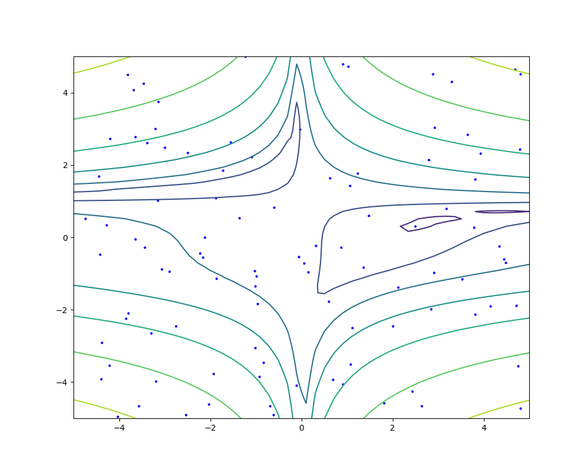

# PSO - Particle Swarm Optimization

This repository contains a simple PSO implementation to play with.

## Getting started
1. Install [pyenv](https://github.com/pyenv/pyenv) and [poetry](https://python-poetry.org/) in your system following the linked official guides.
2. Open a terminal, clone this repository and `cd` to the cloned folder.
3. Run `pyenv install 3.8.0` in your terminal for installing the required python.
   version
4. Configure poetry with `poetry config virtualenvs.in-project true`
5. Create the virtual environment with `poetry install`
6. Activate the environment with `source .venv/bin/activate`
7. Try the algorithm with the default parameters `python main.py`

If everything goes well, it will create a file called `animation.gif` in the examples
folder.

# Parameters
Run `python main.py --help` to check the parameter reference

```
usage: main.py [-h] [-f F] [-p N_PARTICLES] [-w W] [-c1 C1] [-c2 C2]
               [-s N_STEPS] [-r [RANGE [RANGE ...]]] [-v FPS] [-o FILEPATH]
               [-rd SEED]

Parser for animation generator

optional arguments:
  -h, --help            show this help message and exit
  -f F                  Function to optimize. Has to be defined in
                        src/functions.py. Currently availables: "beale",
                        "rosenbrock", "rastrigin" and "beale"
  -p N_PARTICLES        Number of articles
  -w W                  Inertia coefficient
  -c1 C1                Cognitive coefficient
  -c2 C2                Social coefficient
  -s N_STEPS            Number of optimization steps
  -r [RANGE [RANGE ...]]
                        Range of plot and initialization
  -v FPS                Frames per second in the output animation
  -o FILEPATH           Output gif file path
  -rd SEED              Random seed
```

## Examples
### Bowl function
```
python main.py -f bowl -p 100 -s 50 -w 0.3 -c1 0.4 -c2 0.2 -o examples/bowl.gif
```


### Rosenbrock function
```
python main.py -f rosenbrock -p 100 -s 50 -w 1.3 -c1 0.4 -c2 0.7 -o examples/rosenbrock.gif
```


### Rastrigin function
```
python main.py -f rastrigin -p 100 -s 50 -w 0.5 -c1 0.75 -c2 1.0 -o examples/rastrigin.gif
```


### Beale function
```
python main.py -f beale -p 100 -s 50 -w 1.3 -c1 1.0 -c2 0.6 -o examples/beale.gif
```


## References
- [Wikipedia's PSO article](https://en.wikipedia.org/wiki/Particle_swarm_optimization)
- [Wikipedia's Test functions for optimization article](https://en.wikipedia.org/wiki/Test_functions_for_optimization)
- [Particle Swarm Optimization, *James Kennedy and RUssell Eberhart*, *IEEE*, 1942](https://www.cs.tufts.edu/comp/150GA/homeworks/hw3/_reading6%201995%20particle%20swarming.pdf)

## Contribution
Feel free to send issues or pull requests if you want to collaborate.

## License
This repository is licensed under MIT license. More info in the `LICENSE` file. Copyright (c) 2020 Iván Vallés Pérez
